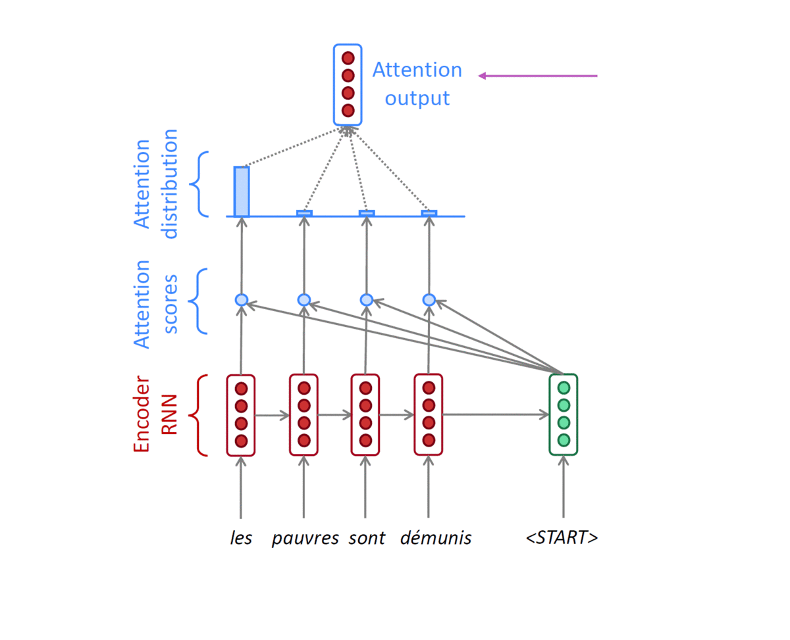

# (5강) Sequence to Sequence with Attention

Sequence를 Encoding와 Decoding할 수 있는 **sequence to sequence**에 대해 알아봅니다.

**Sequence to sequence**는 encoder와 decoder로 이루어져 있는 framework으로 대표적인 자연어 처리 architecture 중 하나입니다. Encoder와 Decoder로는 다양한 알고리즘이 사용될 수 있지만 이번 시간에는 **RNN과 Attention**을 결합한 sequence to sequence 모델을 학습합니다.

앞선 강의에서 설명드렸던 것처럼 RNN 모델이 갖고 있는 단점을 보완하고자 **Attention**(논문에서는 alignment로 표현되고 있습니다) 기법이 처음 등장했습니다. 다양한 Attention의 종류와 이를 활용한 translation task에 대해서 알아봅니다

**Further Reading**

- [Sequence to sequence learning with neural networks, ICML’14](https://arxiv.org/abs/1409.3215)
- [Effective Approaches to Attention-based Neural Machine Translation, EMNLP 2015](https://arxiv.org/abs/1508.04025)
- [CS224n(2019)_Lecture8_NMT](https://web.stanford.edu/class/cs224n/slides/cs224n-2019-lecture08-nmt.pdf)

---

## Seq2Seq with attention

### Seq2Seq Model

- It takes a `sequence of words` as input and gives `a sequence of words as output`
- It composed of an `encoder` and a `decoder`

> Sequence to sequence learning with neural networks, ICML’14

### Seq2Seq Model with Attention

- attention은 encoder decoder의 `bottleneck` 문제를 해결하였다.
- **Core idea :** Decoder의 각 timestep에 대하여, src sequence의 특정한 부분에 집중한다는 아이디어

- Use the attention distribution to take a weighted sum of the encoder hidden states
- The attention output mostly contains information the hidden states that received high attention

- Concatenate attention output with decoder hidden state, then use to compute $\hat{y}_1$as before
	- 첫 번째 Decoder hidden state $h_1^{(d)}$는 Encoder hidden state들의 concatenate $[h_1^{(e)},h_2^{(e)},h_3^{(e)},h_4^{(e)}]$와 Matrix 연산을 진행한다.
	- 위 그림에서는  4 by 4 matrix(concatenate of encoder hidden state)와 4 by 1 matrix(decoder hidden state)를 곱하게 된다. 
	- 그 결과로 나온 4 by 1 matrix(vector)는 encoder의 각 timestep에 해당하는 `attention scores`가 된다. 
	- 이렇게 계산된 attention score는 softmax를 거치게 된다. 
	-  그 결과 각 token에 해당하는 가중치 벡터를 얻게되고, 이 가중치와 encoder hidden state를 반영한 `가중평균`을 바탕을 Attention output vector(Context vector)를 구할 수 있다. 
	- 이때, `ATTENTION MODULE`은 encoder hidden state로 부터 구해지는 Attention score와 Attention distribution(softmax output) 두 부분으로 정의할 수 있다.
	- Attention module의 input과 output은 다음과 같다. 
		- input : decoder의 hidden state, encoder hidden state의 concatenate
		- output : 가중평균으로 계산된 output vector 1개
	- `output layer`는 Context vector와 decoder의 hidden state를 concatenate한 벡터($\hat{y}_1$)가 Input으로 들어간다. 

- Training : Decoder의 input으로 들어가는 단어들은 ground truth로 들어가게 된다. (Teacher forcing 방식)
- Inference : 이때는 첫 번째의 output 단어를 다시 두번째 input 단어로 사용한다. 
- Teacher forcing의 경우, 속도는 빠르지만 실제 사용했을 때 괴리가 있을 수 있다. 

### Different Attention Mechanisms

- **`Luong attention`**: they get the decoder hidden state at time 𝑡, then calculate attention scores, and from that get the context vector which will be concatenated with hidden state of the decoder and then predict the output. 
- **`Bahdanau attention`**: At time **t**, we consider the hidden state of the decoder at time **t − 1**. Then we calculate the alignment, context vectors as above. But then we concatenate this context with hidden state of the decoder at time t − 1. So before the softmax, this concatenated vector goes inside a LSTM unit. 
- **Luong** has different types of alignments. **Bahdanau** has only a concat-score alignment model.

- 다양한 방식의 attention score를 계산하는 방식이 존재한다. 

### Attention is Great!

- **Attention significantly improves NMT performance**
	- It is useful to allow the decoder to focus on particular parts of the source
- **Attention solves the bottleneck problem**
	- Attention allows the decoder to look directly at source; bypass the bottleneck
- **Attention helps with vanishing gradient problem**
	- Provides a shortcut to far-away states
- **Attention provides some interpretability**
	- By inspecting attention distribution, we can see what the decoder was focusing on
	- The network just learned alignment by itself

### Attention Examples in Machine Translation

- It properly learns grammatical orders of words
- It skips unnecessary words such as an article

